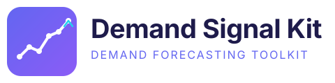

<p align="center">
  
</p>

# Demand Signal Kit

Extensible demand forecasting toolkit with competing models. Uses Polars for data processing and supports multiple forecasting models that can be easily added via a plugin registry.

## Features

- **Multiple models**: LightGBM and Prophet included, with an extensible registry for adding more
- **Cyclical events**: Holidays, promotions, seasonality, and custom event support
- **Feature engineering**: Automatic lag features, rolling statistics, and cyclical time encodings
- **Data sources**: CSV, Parquet, and PostgreSQL
- **Daily forecasts**: Per-product demand forecasting with configurable horizons
- **Web dashboard**: Interactive Streamlit UI for data exploration, training, and forecasting

## Quick Start

```bash
# Install dependencies
uv sync

# Run the demo pipeline
uv run demand-signal-kit demo

# List available models
uv run demand-signal-kit models
```

## CLI Commands

```bash
# Generate sample data and run full pipeline
uv run demand-signal-kit demo

# Train models and compare performance
uv run demand-signal-kit train --source csv --path data.csv -m lightgbm -m prophet

# Generate future forecasts
uv run demand-signal-kit predict --source csv --path data.csv -m lightgbm --horizon 30

# Load and validate data
uv run demand-signal-kit ingest --source csv --path data.csv
```

## Adding New Models

Create a new file in `src/demand_signal_kit/models/`:

```python
import polars as pl
from demand_signal_kit.models.base import BaseForecaster
from demand_signal_kit.models.registry import register_model

@register_model("my_model")
class MyForecaster(BaseForecaster):
    def fit(self, train_df, date_column, target_column, product_column, feature_columns):
        # Training logic
        pass

    def predict(self, future_df, date_column, product_column, feature_columns):
        # Prediction logic
        return pl.DataFrame()
```

The model is automatically discovered and available via CLI.

## Project Structure

```
src/demand_signal_kit/
├── config.py           # Dataclass configurations
├── cli.py              # Click CLI interface
├── data/
│   ├── loader.py       # CSV/Parquet/PostgreSQL loading
│   ├── schema.py       # DataFrame validation
│   └── sample_generator.py
├── features/
│   ├── pipeline.py     # Feature orchestration
│   ├── cyclical.py     # Sin/cos time encodings
│   ├── holidays.py     # Holiday detection
│   ├── lags.py         # Lag features
│   └── rolling.py      # Rolling window statistics
├── models/
│   ├── base.py         # Abstract BaseForecaster
│   ├── registry.py     # Auto-discovery registry
│   ├── prophet_model.py
│   └── lightgbm_model.py
└── evaluation/
    └── metrics.py      # MAE, RMSE, MAPE, SMAPE
```

## Running Tests

```bash
uv run pytest tests/ -v
```

## Web Dashboard

Launch the interactive Streamlit dashboard:

```bash
# Install dashboard dependencies
uv sync --extra dashboard

# Run the dashboard
uv run streamlit run app.py
```

The dashboard provides:
- **Data tab**: Upload CSV/Parquet, connect to PostgreSQL, or generate sample data
- **Features tab**: Build and inspect engineered features with correlation analysis
- **Train tab**: Train multiple models side-by-side with progress tracking
- **Forecast tab**: Generate future predictions with interactive charts
- **Compare tab**: Model comparison with radar charts, per-product breakdowns, and residual analysis
